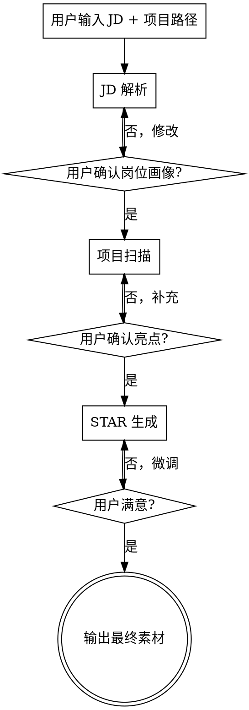

# Resume-Star-Skill Implementation Plan

> **For agentic workers:** REQUIRED SUB-SKILL: Use superpowers:subagent-driven-development (recommended) or superpowers:executing-plans to implement this plan task-by-task. Steps use checkbox (`- [ ]`) syntax for tracking.

**Goal:** Build a Claude Code Skill that helps students generate STAR-format resume descriptions from their projects and target JDs.

**Architecture:** A single skill (`resume-star/SKILL.md`) with three supporting reference files — one per stage (JD analysis, project scan, STAR examples). The skill orchestrates a three-stage conversational flow using Claude Code's built-in tools (Read, Glob, Grep, Bash, WebFetch).

**Tech Stack:** Claude Code Skill (Markdown + YAML frontmatter), no external dependencies.

---

## File Structure

```
resume-star/
├── SKILL.md              # Main skill — frontmatter, overview, three-stage flow, triggers
├── jd-analysis.md        # Reference: JD parsing patterns, categorization rules, examples
├── project-scan.md       # Reference: file patterns, tool commands, project type identification
└── star-examples.md      # Reference: STAR format definition, good/bad examples, templates
```

**Decomposition rationale:**
- Each reference file is independently writable — enables parallel development
- SKILL.md ties the stages together with the conversational flow
- Reference files keep SKILL.md concise (< 500 words) while providing detailed guidance on demand

---

### Task 1: Create skill directory

**Files:**
- Create: `resume-star/` (directory)

- [ ] **Step 1: Create directory**

Run: `mkdir -p resume-star`

Expected: Directory `resume-star/` exists

---

### Task 2: Write JD analysis reference

**Files:**
- Create: `resume-star/jd-analysis.md`

**This file provides:** JD parsing rules, skill categorization, weight assessment, and example parsed JDs. Referenced by SKILL.md Stage 1.

- [ ] **Step 1: Write jd-analysis.md**

Create `resume-star/jd-analysis.md` with the following content:

```markdown
# JD Analysis Reference

## Skill Categories

### Hard Skills (直接提取)
- **编程语言:** Java, Python, Go, C++, JavaScript, TypeScript, Rust 等
- **框架/库:** Spring Boot, React, Vue, Django, Express, Flutter 等
- **工具/平台:** Docker, Kubernetes, AWS, MySQL, Redis, Git, CI/CD 等
- **领域知识:** 机器学习、分布式系统、微服务、数据管道 等

### Soft Skills (从描述推断)
- 团队协作: "与跨部门团队合作"、"推动项目落地"
- 问题解决: "排查线上问题"、"优化性能瓶颈"
- 学习能力: "快速上手"、"跟进新技术"
- 沟通表达: "向非技术团队汇报"、"编写技术文档"

### Implicit Requirements (隐性要求)
- 加班/高压: "拥抱变化"、"快速迭代"、"创业氛围"
- 独立性: "独立负责"、"从 0 到 1"
- 全栈能力: 前后端都提到、提到 DevOps

## Weight Assessment Rules

1. **Must-have (必须):** 反复出现的技能、写在"任职要求"第一条的、与岗位核心职责直接相关的
2. **Nice-to-have (加分):** 写在"优先"、"了解"、"熟悉即可"后面的、只出现一次的
3. **Cultural (隐性):** 从公司规模、行业阶段推断的文化偏好

## Output Format

向用户展示的岗位画像摘要格式:

```
## 岗位画像: [职位名称] @ [公司名]

### 核心要求 (Must-have)
- [技能1] — [为什么重要]
- [技能2] — [为什么重要]

### 加分项 (Nice-to-have)
- [技能3], [技能4]

### 隐性信号
- [信号1: 推断依据]
- [信号2: 推断依据]

### 匹配建议
这个岗位最看重 [X]，你的项目如果能体现 [Y] 会很有竞争力。
```

## Example: Parsed JD

**输入 (JD 原文片段):**
> 岗位要求: 1. 熟悉 Java 语言，了解 Spring Boot 框架 2. 熟悉 MySQL，有 SQL 调优经验优先 3. 了解 Redis、MQ 等中间件 4. 良好的团队协作能力，能独立完成模块开发 5. 有微服务经验者优先

**输出:**
- Must-have: Java, Spring Boot, MySQL
- Nice-to-have: SQL 调优, Redis, MQ, 微服务
- 隐性信号: "独立完成模块开发" → 需要展示独立负责能力；"微服务优先" → 公司在做服务化改造
```

- [ ] **Step 2: Verify file exists and content is correct**

Run: `cat resume-star/jd-analysis.md | head -5`
Expected: Shows the markdown header and first few lines

---

### Task 3: Write project scan reference

**Files:**
- Create: `resume-star/project-scan.md`

**This file provides:** File glob patterns, tool commands, project type identification rules, and fallback handling. Referenced by SKILL.md Stage 2.

- [ ] **Step 1: Write project-scan.md**

Create `resume-star/project-scan.md` with the following content:

```markdown
# Project Scan Reference

## Project Type Identification

检查项目根目录的特征文件来判断项目类型:

| 特征文件 | 项目类型 | 关键扫描目标 |
|----------|---------|------------|
| package.json | 前端 / Node.js 后端 / 全栈 | dependencies, scripts, README |
| requirements.txt / setup.py / pyproject.toml | Python 项目 | 依赖列表, README |
| pom.xml / build.gradle | Java 项目 | dependencies, README |
| go.mod | Go 项目 | dependencies, README |
| Cargo.toml | Rust 项目 | dependencies, README |
| pubspec.yaml | Flutter / Dart | dependencies, README |
| *.xcodeproj / *.xcworkspace | iOS 项目 | README |
| docker-compose.yml | 有容器化部署 | 额外加 1 分（可写进简历） |

## Scan Sequence

按以下顺序扫描，每步收集信息后判断是否需要继续:

### Step 1: Directory Structure
```
命令: ls -la <project_path>
目标: 了解顶层目录布局
关注: src/, lib/, app/, api/, config/, test/ 等常见目录
```

### Step 2: Config Files (技术栈)
```
命令: glob <project_path>/{package.json,requirements.txt,pyproject.toml,pom.xml,build.gradle,go.mod,Cargo.toml,pubspec.yaml,Gemfile,*.csproj}
目标: 确定语言、框架、主要依赖
关注: dependencies/devDependencies 中的框架和库
```

### Step 3: README
```
命令: read <project_path>/README.md
目标: 了解项目目的、功能描述、架构说明
关注: 项目简介、功能列表、技术架构描述
```

### Step 4: Key Source Files
```
命令: glob <project_path>/src/**/*.{java,py,js,ts,go,rs} 或对应语言扩展名
目标: 识别核心功能模块
关注: 文件/目录命名反映的功能（如 auth/, payment/, search/）
      路由文件（router, urls, routes）反映的功能范围
```

### Step 5: Git Log (optional)
```
命令: bash: git -C <project_path> log --oneline -20
目标: 了解开发活跃度和贡献范围
关注: commit 频率、涉及的功能模块
如果失败（非 Git 仓库）: 跳过，不影响扫描
```

## Highlight Extraction Rules

从扫描结果中提取亮点，按以下优先级:

1. **解决了什么问题:** README 或 commit message 中描述的业务问题
2. **用了什么技术:** 从 config 文件中提取的技术栈，特别是有亮点的技术（如用了 Redis 做缓存、用了消息队列）
3. **做了什么功能:** 从目录结构和路由文件中推断的功能模块
4. **有什么规模:** 数据量、并发量、用户量等可量化的指标（如果有）

## Output Format

向用户展示的项目亮点列表格式:

```
## 项目扫描: [项目名称]

### 基本信息
- 类型: [前端/后端/全栈/...]
- 技术栈: [语言] + [框架] + [关键依赖]
- 项目结构: [简要描述目录组织]

### 发现的亮点
1. **[亮点标题]** — [简述: 做了什么, 用了什么技术]
2. **[亮点标题]** — [简述]
3. **[亮点标题]** — [简述]

### 可能遗漏
- [提示用户补充可能没被扫描到的信息]
```

## Fallback: 无本地项目

如果用户没有本地项目或项目过于简单:

1. 直接询问用户: "请描述一下你参与的项目——做了什么功能、用了什么技术、解决了什么问题？"
2. 基于用户描述提取亮点，跳过文件扫描
3. 继续进入 STAR 生成阶段
```

- [ ] **Step 2: Verify file exists**

Run: `cat resume-star/project-scan.md | head -5`
Expected: Shows the markdown header and first few lines

---

### Task 4: Write STAR examples reference

**Files:**
- Create: `resume-star/star-examples.md`

**This file provides:** STAR format definition, good/bad examples for both tech and business styles, quantification tips. Referenced by SKILL.md Stage 3.

- [ ] **Step 1: Write star-examples.md**

Create `resume-star/star-examples.md` with the following content:

```markdown
# STAR Examples Reference

## STAR Format Definition

- **S (Situation):** 项目背景和面临的挑战（1句话）
- **T (Task):** 你负责的具体任务（1句话）
- **A (Action):** 你采取了什么行动，用了什么技术（2-3句话，这是核心）
- **R (Result):** 产生了什么结果，尽量量化（1句话）

## Style Guide

### 技术向表述
适合投技术岗位，突出技术深度:
- 强调技术选型理由、架构决策
- 提及具体的技术方案和工具
- 量化技术指标（延迟降低 X%、QPS 提升 Y 倍）

### 业务向表述
适合投偏业务岗位或非纯技术岗:
- 强调解决了什么业务问题
- 提及业务影响（用户量、营收、效率）
- 少用技术术语，用业务语言描述

## Good Examples

### Example 1: 课程项目（技术向）

**S:** 在编译原理课程中，需实现一个支持类型推断的 Mini-Java 编译器前端。
**T:** 负责语法分析器和类型检查模块的设计与实现。
**A:** 使用 ANTLR4 构建语法树，手写 Visitor 模式实现类型推断算法，支持泛型和继承的类型检查，通过单元测试覆盖 50+ 边界用例。
**R:** 编译器成功通过全部 200 个测试用例，类型推断准确率 98%，获得课程最高分。

**简历 Bullet Point 版本（更精炼）:**
> 实现支持泛型类型推断的 Mini-Java 编译器前端，基于 ANTLR4 + Visitor 模式，通过 200 个测试用例，类型推断准确率 98%

### Example 2: 实习项目（业务向）

**S:** 实习期间，公司内部工单系统响应缓慢，平均处理时间超过 48 小时。
**T:** 负责优化工单分配逻辑，提升处理效率。
**A:** 分析工单数据发现分配规则不合理，重新设计了基于技能标签的智能匹配算法，将工单自动分配率从 30% 提升至 85%。
**R:** 工单平均处理时间从 48 小时降至 12 小时，用户满意度提升 20%。

**简历 Bullet Point 版本:**
> 优化内部工单系统分配算法，基于技能标签实现智能匹配，自动分配率从 30% 提升至 85%，平均处理时间降低 75%

### Example 3: 个人项目

**S:** 校园内缺乏统一的二手交易平台，学生依赖微信群发布信息。
**T:** 独立开发一个校园二手交易微信小程序。
**A:** 使用云开发（CloudBase）+ Vue.js，实现商品发布、搜索、收藏、聊天功能，集成微信支付模拟流程，部署到微信小程序平台。
**R:** 上线 2 周内注册用户 500+，日均活跃用户 80+，促成 100+ 笔交易。

**简历 Bullet Point 版本:**
> 独立开发校园二手交易小程序（Vue + 微信云开发），实现发布/搜索/聊天/支付全流程，上线 2 周获 500+ 用户、促成 100+ 笔交易

## Bad Examples (要避免)

### ❌ 太笼统
> 参与了电商项目的开发，负责后端模块

问题: 没说做了什么、用了什么技术、有什么成果

### ❌ 只列技术名词
> 使用了 Spring Boot + MySQL + Redis + RabbitMQ

问题: 堆技术名词但不说明解决了什么问题

### ❌ 假大空的结果
> 大幅提升了系统性能，获得了领导和同事的一致好评

问题: 没有量化数据，"好评"不是有效结果

### ❌ 抄袭模板痕迹重
> 运用敏捷开发方法论，通过 Scrum 框架推动团队高效协作...

问题: 在校生项目不需要这种企业级话术，面试官一看就知道是编的

## Quantification Tips

在校生项目可能觉得没有数据可量化，以下思路可以帮助找到量化角度:

| 场景 | 量化角度 |
|------|---------|
| 课程项目 | 测试用例数量、代码行数、功能模块数、覆盖的边界情况 |
| 性能优化 | 响应时间变化、内存占用变化、支持的数据量 |
| 功能开发 | 完成的功能点数量、支持的用户操作数 |
| 个人项目 | 用户数、日活、交易量、页面浏览量 |
| 实验项目 | 准确率/精确率/召回率、实验数据集规模 |
| 团队项目 | 团队规模、你负责的模块占总模块的比例 |

## Output Format

向用户展示的 STAR 描述块格式:

```markdown
## STAR 简历素材

### 1. [亮点关键词] — [技术向]
> [精炼的简历 Bullet Point，1-2 行]

**完整 STAR 展开:**
- **S:** [背景]
- **T:** [任务]
- **A:** [行动]
- **R:** [结果]

---

### 2. [亮点关键词] — [业务向]
> [精炼的简历 Bullet Point，1-2 行]

**完整 STAR 展开:**
- **S:** [背景]
- **T:** [任务]
- **A:** [行动]
- **R:** [结果]

---

*提示: Bullet Point 版本可直接粘贴到简历中，完整 STAR 展开用于面试准备。*
```
```

- [ ] **Step 2: Verify file exists**

Run: `cat resume-star/star-examples.md | head -5`
Expected: Shows the markdown header and first few lines

---

### Task 5: Write main SKILL.md

**Depends on:** Task 1, 2, 3, 4

**Files:**
- Create: `resume-star/SKILL.md`

**This file is the main skill** — defines triggers, orchestrates the three-stage flow, references the supporting files.

- [ ] **Step 1: Write SKILL.md**

Create `resume-star/SKILL.md` with the following content:

```markdown
---
name: resume-star
description: Use when the user wants to write or improve resume content for a job application — pasting a JD and pointing to a local project to generate STAR-format resume bullet points. Also use when the user asks for help with resume writing, STAR descriptions, or matching their projects to job requirements.
---

# Resume Star

帮在校生从项目经历中提取亮点，结合目标 JD 要求，生成 STAR 格式简历素材。

## Overview

三阶段流程，对话贯穿:

1. **JD 解析** — 理解岗位要什么人
2. **项目扫描** — 发现你有什么可写
3. **STAR 生成** — 把经历写成简历语言

每个阶段结束都向用户展示中间结果并确认，用户可随时回退修改。

## When to Use

- 用户粘贴了 JD 文本或链接，想针对某个岗位写简历
- 用户想把自己的项目经历转化为简历描述
- 用户问"简历怎么写"、"STAR 怎么写"
- 用户提供了本地项目路径，想从中提取简历素材

## Flow



## Stage 1: JD 解析

**输入:** 用户粘贴的 JD 文本，或 JD 链接（用 WebFetch 抓取）

**处理:** 参考 `jd-analysis.md` 中的分类规则和权重评估方法:
1. 提取硬技能关键词
2. 推断软技能和隐性要求
3. 评估 must-have vs nice-to-have 权重
4. 识别岗位风格信号

**向用户展示:**
> "我分析了这份 JD，核心要求是 X、Y、Z，其中 X 最重要。这样理解对吗？"

等待用户确认后再进入下一阶段。

## Stage 2: 项目扫描

**输入:** 用户提供的本地项目路径

**Fallback:** 如果用户没有本地项目，直接问 "请描述一下你参与的项目——做了什么功能、用了什么技术、解决了什么问题？"，基于描述提取亮点。

**处理:** 参考 `project-scan.md` 中的扫描序列:
1. 检查目录结构，识别项目类型
2. 读取配置文件，提取技术栈
3. 读 README，了解项目概况
4. 扫描关键源文件，识别功能模块
5. （可选）查看 git log，了解开发历程

**向用户展示:**
> "我从你的项目中发现这些亮点：A、B、C。你觉得哪个最值得展开？有没有我遗漏的？"

等待用户确认后再进入下一阶段。

## Stage 3: STAR 生成

**输入:** Stage 1 的岗位画像 + Stage 2 的项目亮点

**处理:** 参考 `star-examples.md` 中的格式和示例:
1. 将亮点与 JD 要求匹配，优先匹配度高的
2. 每个亮点生成 STAR 描述（S-T-A-R 四要素）
3. 提供精炼的 Bullet Point 版本（直接粘贴用）
4. 尽量量化结果（参考 star-examples.md 的量化思路）

**向用户展示:**
> "这是基于你的项目和目标岗位生成的简历描述，你可以告诉我哪里需要调整——比如更技术向还是更业务向，要展开还是精简。"

支持用户微调指令: "更硬核一点"、"强调架构"、"扩写/缩写"、"换一个表述风格"。

## Output Format

最终输出包含:
- 2-3 条 **Bullet Point** 版本（可直接粘贴到简历）
- 每条的 **完整 STAR 展开**（用于面试准备）

格式参考 `star-examples.md` 的 Output Format 部分。

## Common Mistakes

| 错误 | 正确做法 |
|------|---------|
| 直接生成不确认 | 每个阶段结束必须展示中间结果并等待确认 |
| 生成空泛的描述 | 每条 STAR 必须包含具体技术细节 |
| 堆砌技术名词 | 先说解决了什么问题，再说用了什么技术 |
| 编造量化数据 | 如果项目确实没有数据，诚实表述，不编数字 |
| 用企业级话术 | 在校生用学生的语言，面试官能分辨 |
| 忽略 JD 匹配 | STAR 必须针对 JD 要求来写，不是泛泛描述 |
```

- [ ] **Step 2: Verify SKILL.md exists and frontmatter is valid**

Run: `head -5 resume-star/SKILL.md`
Expected: Shows YAML frontmatter with `name: resume-star`

---

### Task 6: Integration test

**Depends on:** Task 5

**Files:**
- No new files

**This task validates the complete skill by running a simulated scenario.**

- [ ] **Step 1: Verify skill file structure**

Run: `ls -la resume-star/`
Expected: 4 files — SKILL.md, jd-analysis.md, project-scan.md, star-examples.md

- [ ] **Step 2: Verify SKILL.md references all supporting files**

Run: `grep -c "jd-analysis.md\|project-scan.md\|star-examples.md" resume-star/SKILL.md`
Expected: 3 or more (each supporting file is referenced at least once)

- [ ] **Step 3: Verify no TODO/TBD/placeholders in any file**

Run: `grep -ri "TODO\|TBD\|FIXME\|placeholder" resume-star/`
Expected: No output (no matches)

- [ ] **Step 4: Commit all skill files**

```bash
git add resume-star/
git commit -m "feat: add resume-star skill with three-stage JD→project→STAR flow"
```

---

## Parallelism Map

```
Task 1 (mkdir)
    │
    ├── Task 2 (jd-analysis.md)     ──┐
    ├── Task 3 (project-scan.md)     ──┤  ← parallel
    └── Task 4 (star-examples.md)    ──┘
                                       │
                                  Task 5 (SKILL.md — depends on 1-4)
                                       │
                                  Task 6 (integration test — depends on 5)
```

Tasks 2, 3, 4 are fully independent and can be developed in parallel.
