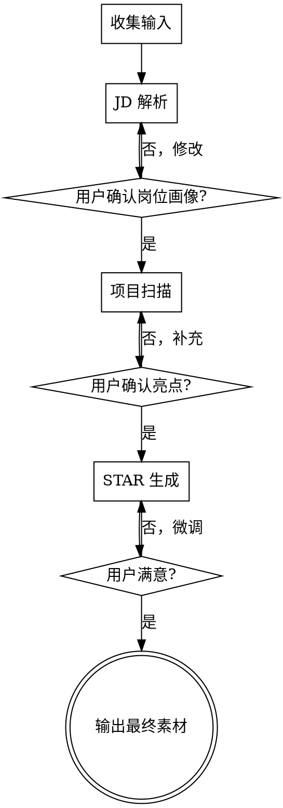

# Resume Star

帮在校生从项目经历中提取亮点，结合目标 JD 要求，生成 STAR 格式简历素材。

## Overview

三阶段流程，对话贯穿:

1. **JD 解析** — 理解岗位要什么人
2. **项目扫描** — 发现你有什么可写
3. **STAR 生成** — 把经历写成简历语言

每个阶段结束都向用户展示中间结果并确认，用户可随时回退修改。

## When to Use

- 用户粘贴了 JD 文本或链接，想针对某个岗位写简历
- 用户想把自己的项目经历转化为简历描述
- 用户问"简历怎么写"、"STAR 怎么写"
- 用户提供了本地项目路径，想从中提取简历素材
- 用户说"帮我看看简历""审查简历""简历有什么问题"
- 用户粘贴了整份简历，想知道哪里该改
- 用户粘贴了多条 JD，或说"我有多个岗位要投"
- 用户有多个项目，想知道简历里应该放哪个
- 用户说"面试会问什么""帮我准备面试题""技术问题预测"
- 用户说"模拟面试""练一下项目介绍""帮我练口语"
- 用户想准备面试，需要练习项目经历的口头表达

## 启动：收集输入

Skill 触发后，**必须按以下固定格式**一次性收集两个输入:

> 请提供以下信息:
>
> **1. 目标岗位 JD**
> 粘贴岗位描述全文，或提供招聘链接（我会自动抓取）。
>
> **2. 项目路径**
> 提供你要写的项目在本地的文件夹路径（如 `D:/projects/my-app`）。
> 如果没有本地项目，回复"无项目"即可，我会通过对话帮你梳理经历。

判断逻辑:
- 如果用户在触发 Skill 时已经同时提供了 JD 文本 + 项目路径 → 跳过询问，直接进入阶段 1
- 如果只提供了其中一项 → 只询问缺失的那一项
- 如果都没提供 → 使用上面的完整询问格式

## Flow



## Stage 1: JD 解析

**输入:** 用户粘贴的 JD 文本，或 JD 链接（用 WebFetch 抓取）

**处理:** 参考 `jd-analysis.md` 中的分类规则和权重评估方法:
1. 提取硬技能关键词
2. 推断软技能和隐性要求
3. 评估 must-have vs nice-to-have 权重
4. 识别岗位风格信号

**向用户展示:**
> "我分析了这份 JD，核心要求是 X、Y、Z，其中 X 最重要。这样理解对吗？"

等待用户确认后再进入下一阶段。

## Stage 2: 项目扫描

**输入:** 用户提供的本地项目路径

**Fallback:** 如果用户没有本地项目，直接问 "请描述一下你参与的项目——做了什么功能、用了什么技术、解决了什么问题？"，基于描述提取亮点。

**处理:** 参考 `project-scan.md` 中的扫描序列:
1. 检查目录结构，识别项目类型
2. 读取配置文件，提取技术栈
3. 读 README，了解项目概况
4. 扫描关键源文件，识别功能模块
5. （可选）查看 git log，了解开发历程

**向用户展示:**
> "我从你的项目中发现这些亮点：A、B、C。你觉得哪个最值得展开？有没有我遗漏的？"

等待用户确认后再进入下一阶段。

## Stage 3: STAR 生成

**输入:** Stage 1 的岗位画像 + Stage 2 的项目亮点

**处理:** 参考 `star-examples.md` 中的格式和示例:
1. 将亮点与 JD 要求匹配，优先匹配度高的
2. 每个亮点生成分点描述: **动词开头 + 做了什么 + 怎么做的 + 效果/指标**
3. 分点描述要信息密集（1-3 行），不能为了简洁丢失技术细节
4. 量化结果尽量放在句末；无数据则用定性成果
5. 同时提供 STAR 展开用于面试准备

**向用户展示:**
> "这是基于你的项目和目标岗位生成的简历描述，你可以告诉我哪里需要调整——比如更技术向还是更业务向，要展开还是精简。"

支持用户微调指令: "更硬核一点"、"强调架构"、"扩写/缩写"、"换一个表述风格"。

## Output Format

最终输出**必须包含以下两部分**:

### 第一部分：可直接复制的分点描述（核心输出）
- 每条以**强动词开头**（设计并实现、开发、构建、优化、实现…），不用"参与了"、"负责了"
- 结构: 动词 + 做了什么 + 怎么做的 + 效果/指标
- 每条 1-3 行，信息密度要高，不为简洁丢细节
- 量化结果放句末，无数据则用定性成果

### 第二部分：STAR 展开说明（面试准备）
每条的完整背景-任务-行动-结果四要素展开，用于面试时回忆细节。

格式参考 `star-examples.md` 的 Output Format 部分。

## Batch Mode (多 JD 批量处理)

当用户提供多个 JD 时自动进入批量模式。

### 触发条件
- 用户粘贴了多条 JD（用 `---` 分隔，或一次提供多个 JD 文本块）
- 用户说"我有多个岗位""帮我匹配多个 JD"

### 流程
1. **JD 批量解析:** 逐个解析每条 JD，提取各自的岗位画像
2. **项目扫描（一次）:** 扫描项目一次，结果复用给所有 JD
3. **交叉匹配:** 每条 JD 的 must-have 与项目亮点做匹配
4. **输出对照表:** 每条 JD 对应的推荐亮点 + 定制 Bullet Point + 匹配度

### 向用户展示
> "你提供了 [N] 个 JD。我分别分析了每个岗位的要求，并与你的项目做了匹配。匹配度最高的是 [JD X]，最需要补充的是 [JD Y]。"

### 项目排序建议（自动包含）
如果用户提供了多个项目:
- 基于所有 JD 的 must-have 综合统计，对每个项目打分
- 输出排序表 + 建议理由
- 格式参考 `star-examples.md` 的 Batch Output Format 部分

## Interview Prep (面试问题预测)

基于 JD 要求 + 项目技术栈，预测面试可能问的技术问题。

### 触发条件
- 用户说"面试会问什么""技术问题""帮我准备面试"
- 也可在 JD 解析结束后主动提示："要不要看看这个岗位可能会问什么技术问题？"

### 输入
- JD 岗位画像（来自 Stage 1 或独立输入的 JD）
- 项目技术栈（来自 Stage 2 扫描结果，或用户手动描述）

### 处理
参考 `interview-prep.md` 中的预测规则:
1. 对每个 must-have 技能生成 2-3 个分层问题（基础/中等/深入）
2. 对项目中使用的每个技术生成项目相关追问
3. 加入通用软技能问题
4. 按优先级排序（JD 高频 + 项目使用 > JD 高频 > 项目使用 > 软技能）

### 向用户展示
> "基于这个岗位的要求和你的项目经历，我预测了以下面试问题。按优先级从高到低排列——标红的题目建议重点准备。"

## Interview Simulation (面试模拟 + 口述训练)

基于已生成的 STAR 展开部分，进行模拟面试追问和口述训练。

### 触发条件
- 用户说"模拟面试""练一下""帮我练口语"
- STAR 生成结束后主动提示："要不要针对这条练一下面试回答？"

### 两种模式

#### 模式 A: 面试模拟（对话式）

参考 `interview-sim.md` 中的模拟流程:

1. 从 STAR 展开中选取一个亮点作为话题
2. 扮演面试官，先问开放性问题
3. 用户回答后追问（技术深度 / 结果量化 / 替代方案 / 困难挑战）
4. 每轮给出回答反馈 + 参考回答 + 下一个追问
5. 用户输入"退出模拟"结束

#### 模式 B: 口述训练（脚本生成）

参考 `interview-sim.md` 中的口述脚本规则:

1. 将 Bullet Point 转化为 1 分钟版口述脚本（项目概述）
2. 同时提供 3 分钟版口述脚本（详细展开）
3. 附带口述技巧提醒（停顿点、强调点、防跑题提醒）
4. 用户可以要求调整口述风格

### 向用户展示
> "我可以帮你练一下项目介绍。你想先模拟面试（我来追问），还是先生成口述脚本（你自己练）？"

## Resume Review (简历审查)

独立流程，不经过三阶段。当用户触发简历审查时执行。

### 触发条件
- 用户说"帮我看看简历""审查简历""简历有什么问题"
- 用户粘贴了整份简历文本

### 输入
- 用户的整份简历文本
- 目标 JD 文本（可选，如果提供则增加匹配度评估）

### 处理
1. 分析简历结构（教育背景、项目经历、技能列表、实习经历等是否齐全）
2. 如果提供了 JD → 评估 JD 匹配度（must-have 覆盖率）
3. 识别弱点：空泛描述、弱动词、缺少量化数据、格式不一致
4. 对每个问题给出具体修改建议（原文 → 建议修改）

### 输出格式

```
## 简历审查报告

### 整体评分: [高/中/低]

### JD 匹配度（如果提供了 JD）
- Must-have 覆盖: [X/Y]
- 未覆盖的技能: [...]

### 结构检查
- [✓/✗] 教育背景: [评价]
- [✓/✗] 项目经历: [评价]
- [✓/✗] 技能列表: [评价]
- [✓/✗] 实习/工作经历: [评价]

### 具体修改建议
- **第 X 段:** [原文片段] → [建议修改]（理由: [为什么]）
- **第 Y 段:** [原文片段] → [建议修改]（理由: [为什么]）

### 缺失内容
- [JD 要求但简历中未体现的技能/经历]
- [建议补充的内容]
```

### 向用户展示
> "我审查了你的简历，整体质量 [高/中/低]。主要问题是 A、B。具体修改建议如下..."

## 量化规则
- 如果 Result 部分能从项目信息中推断出量化数据（测试用例数、模块数、功能点数等），**必须展示量化结果**
- 如果项目确实没有可量化的数据，诚实描述定性成果，**绝对不能编造数字**
- 量化来源: README 中的项目规模、配置文件中的依赖数、目录结构中的模块数、测试文件中的用例数

## 语言检测与输出规则

### 语言检测
- JD 解析阶段自动检测 JD 语言（中文/英文）
- 如果 JD 是英文 → 所有输出（岗位画像、Bullet Point、STAR 展开）使用英文
- 如果 JD 是中文 → 所有输出使用中文
- 用户可随时用"用英文输出"/"用中文输出"强制切换语言

### 输出语言要求
- 中文输出: 统一中文，仅技术专有名词保留英文（如 Spring Boot、React、Redis）
- 英文输出: 全英文，包括岗位画像、Bullet Point 和 STAR 展开
- 不出现中英文混合的标题或描述（技术名词除外）

## Common Mistakes

| 错误 | 正确做法 |
|------|---------|
| 直接生成不确认 | 每个阶段结束必须展示中间结果并等待确认 |
| 生成空泛的描述 | 每条 STAR 必须包含具体技术细节 |
| 堆砌技术名词 | 先说解决了什么问题，再说用了什么技术 |
| 编造量化数据 | 如果项目确实没有数据，诚实表述，不编数字 |
| 用企业级话术 | 在校生用学生的语言，面试官能分辨 |
| 忽略 JD 匹配 | STAR 必须针对 JD 要求来写，不是泛泛描述 |
| 只输出 STAR 展开 | 必须同时输出可直接复制的分点描述，且放在前面 |
| 中英文混排 | 根据 JD 语言自动选择中文/英文输出，仅技术名词保留原文 |
| 用弱动词开头 | 不用"参与了""负责了"，用"设计并实现""开发""构建""优化"等强动词 |
| 描述过于简短 | 每条 1-3 行，要有足够的技术细节，不为简洁丢信息 |
